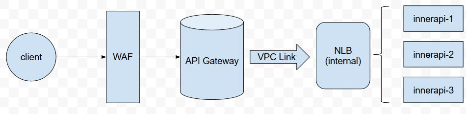
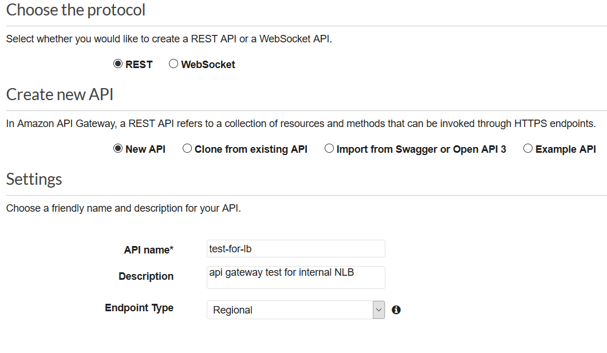
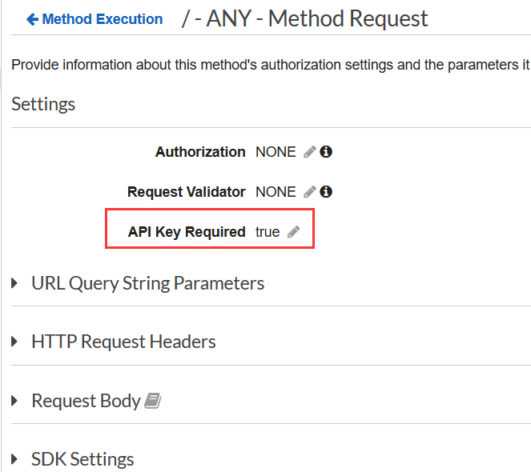
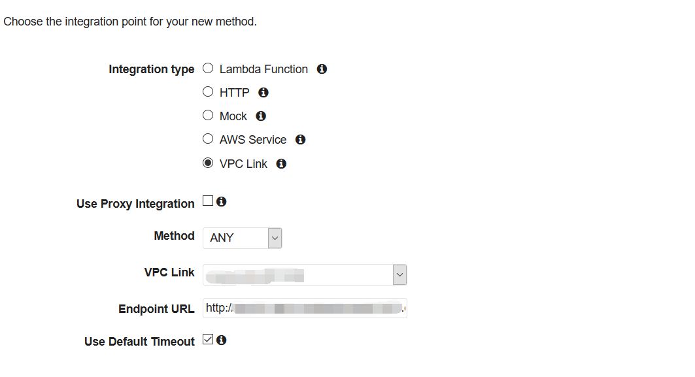
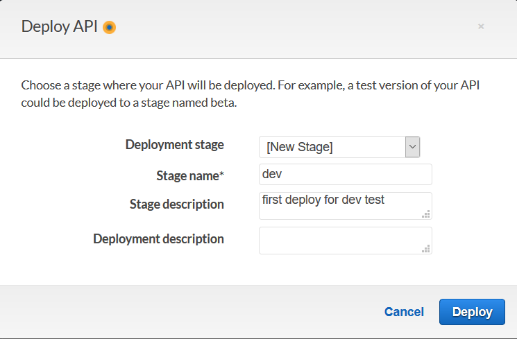
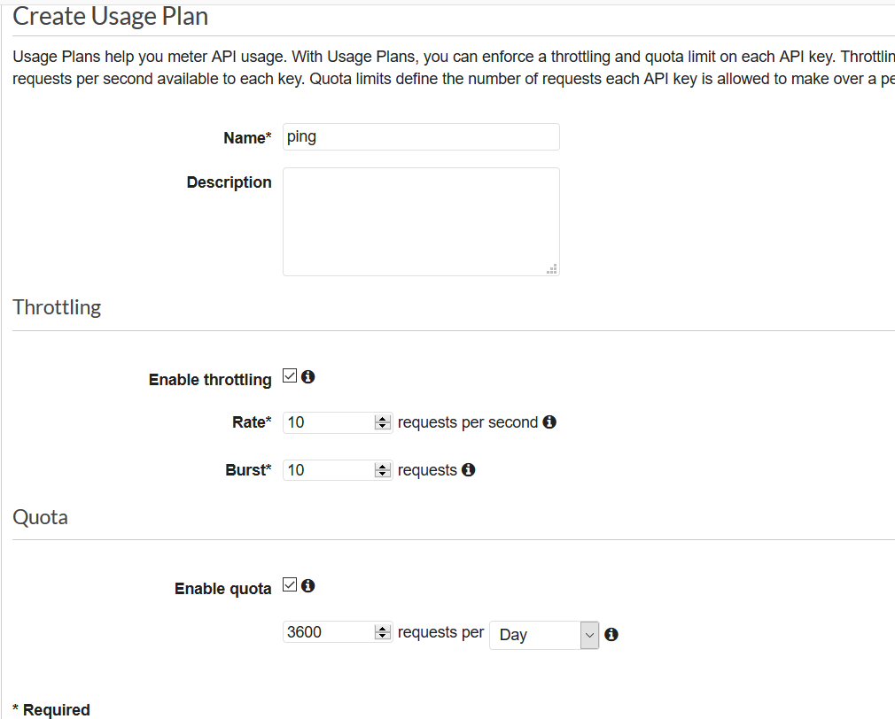
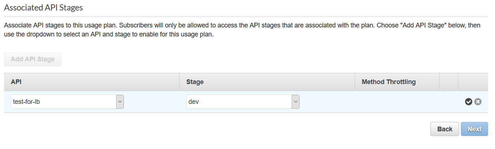
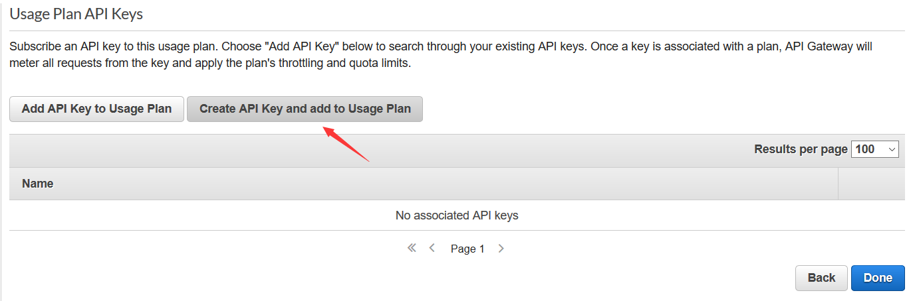
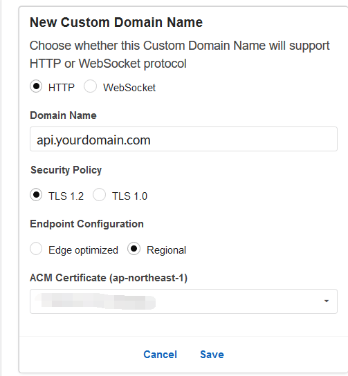

## AWS api-gateway 管理VPC私有HTTP/HTTPS API
AWS API gateway 提供了一整套部署和管理API的方法。通过VPC link，api gateway可以访问VPC内的private resource。

### 项目需求
通过api gateway 将VPC内private subnet的api接口中的一部分对外开放，并通过IP限制请求。

### AWS 组件
- API gateway
- NLB
- WAF

### 整体架构


### EC2测试机
在VPC的private subnet内创建一台nginx server，并设置一个location：
```nginx
location /ping {
    default_type application/json;
    return 200 '{"hello" : "world"}';
}
```

### 配置 NLB(internal)
由于VPC内的资源不对外开放，api gateway无法从public internet获取VPC内资源，所以必须通过VPC Link获取。VPC Link需要从NLB（不支持ALB）建立api gateway到VPC的链接。
参考：<https://docs.aws.amazon.com/apigateway/latest/developerguide/set-up-private-integration.html>
创建一个NLB名为: test-for-NLB, 监听80端口，target group中的backend为刚才创建的EC2测试机。

### 配置 VPC Link
在API gateway控制台的左侧导航栏中选择VPC Links-> Create。在Target NLB中选择刚才创建的test-for-NLB。

### 配置 API gateway
API配置步骤较多，大体如下：
- Create API
- Create Method
- Deploy Stage
- Create Usage plan 
- Create API Key
- Custom Doman Name

#### 创建 API gateway
在API gateway控制台的左侧导航栏中选择APIs -> Create API


Endpoint Type 有3个选项，分别代表：
1. regional（类似于ELB）
2. edge optimized (类似于cloudfront)
3. private （类似于internal ELB）
如果API需要对外开放，请选择regional和edge optimized。如果需要网络路由优化，选择edge optimized。
将method的api key设为启用：点击 ANY -> Method Request -> 修改 API Key Required 为true.


 
#### 创建 method
在API gateway控制台的左侧导航栏中选择刚才创建好的test-for-lb, 选择Resources,创建一个ANY的method。

VPC Link为我们刚才创建的VPC Link， 点击文本框会自动下拉弹出。
Endpoint URL为NLB的DNS地址，注意协议。


#### 部署 Stage
在Resources的/下点击Actions -> Deploy API，部署一个名为dev的stage。


#### 创建Usage Plan
在API gateway控制台的左侧导航栏中选择Usage Plan -> Create。

+ Throttling
    + Enable throttling  如果关闭，每秒请求数将没有限制最大为：10000/s
    + Rate  每秒限制请求数
    + Burst 
    
+ Quota
    + Enable quota 如果关闭，请求总数将没有限制
    + < > requests pe <day|week|month>
#### 绑定到stage


#### 创建API key


#### 测试API
```bash
curl -H "x-api-key: YOUR_API_KEY" https://YOUR_STAGE_INVOKE_URL
```

### 配置WAF 
API gateway可以通过WAF来进行ACL，配置起来相当方便。
AWS WAF -> Create web ACL 注意WAF Resource type要选择API Gateway， 然后依次选择对应的API和stage。rule和ip range配置参考WAF文档。
<https://docs.aws.amazon.com/waf/latest/developerguide/getting-started.html>

### 配置 Custom Domain Name
在API gateway控制台的左侧导航栏中选择 Custom Domain Names -> Create Custom Domain Name

- Domain Name 需要设定的自定义域名。
- Endpoint Configuration 选择cloudfront或regional方式。
- ACM Certificate 需要提前将对应的SSL证书导入到对应的region中。
- Base Path Mappings 可以实现PATH到stage的路由。这里可以设定path为api, 到test-for-lb的dev stage。
创建完毕。

在你的域名中，将你设定的域名CNAME到Target Domain Name上，创建好的Custom Domain Name上会显示Target Domain Name。

### 最终测试
```bash
curl -H "x-api-key: YOUR_API_KEY" https://api.yourdomain.com/api
```
return
```bash
{"hello" : "world"}
```

